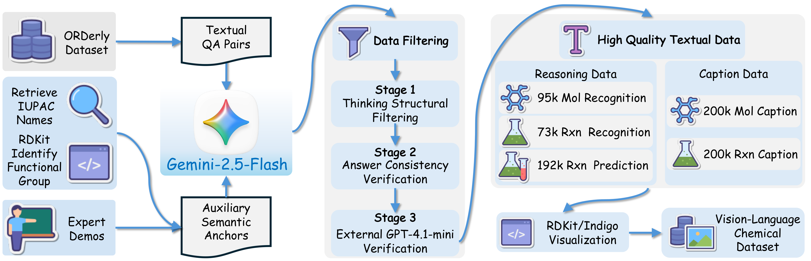
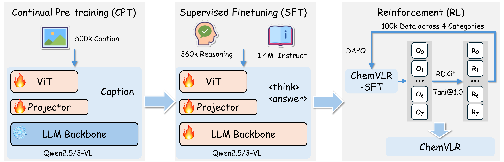

# ChemVLR: Prioritizing Reasoning in Perception for Chemical Vision-Language Understanding (ACL 2026 Findings)

[](#) [](https://huggingface.co/xxxllz/ChemVLR-7B) [](https://huggingface.co/xxxllz/ChemVLR-8B) [](https://arxiv.org/abs/2604.06685)

This repository is the official implementation of [ChemVLR: Prioritizing Reasoning in Perception for Chemical Vision-Language Understanding](https://arxiv.org/abs/2604.06685).

> ChemVLR: Prioritizing Reasoning in Perception for Chemical Vision-Language Understanding
>
> Xuanle Zhao, Xinyuan Cai†, Xiang Cheng, Xiuyi Chen, Bo Xu†

## News

**[2026.4.8]** ChemVLR has been accepted by **ACL 2026 Findings**. We have released our model weights on HuggingFace.

## Overview





## Models

| Model | Backbone | Download |
| ---- | ---- | ---- |
| ChemVLR-7B | Qwen2.5-VL-7B | [HuggingFace](https://huggingface.co/xxxllz/ChemVLR-7B) |
| ChemVLR-8B | Qwen3-VL-8B-Instruct | [HuggingFace](https://huggingface.co/xxxllz/ChemVLR-8B) |

## Reward Function

We provide the reward function used in the RL stage at [`reward_function/tani_sim_em.py`](reward_function/tani_sim_em.py).

## Contact

For any questions, please contact [zhaoxuanle2022@ia.ac.cn](mailto:zhaoxuanle2022@ia.ac.cn).

## Citation

```
@misc{zhao2026chemvlrprioritizingreasoningperception,
      title={ChemVLR: Prioritizing Reasoning in Perception for Chemical Vision-Language Understanding}, 
      author={Xuanle Zhao and Xinyuan Cai and Xiang Cheng and Xiuyi Chen and Bo Xu},
      year={2026},
      eprint={2604.06685},
      archivePrefix={arXiv},
      primaryClass={cs.CL},
      url={https://arxiv.org/abs/2604.06685}, 
}
```

## Acknowledgement

ChemVLR is built upon [Qwen2.5-VL](https://github.com/QwenLM/Qwen2.5-VL) and [Qwen3-VL](https://github.com/QwenLM/Qwen3-VL). We thank these great works for open sourcing!
